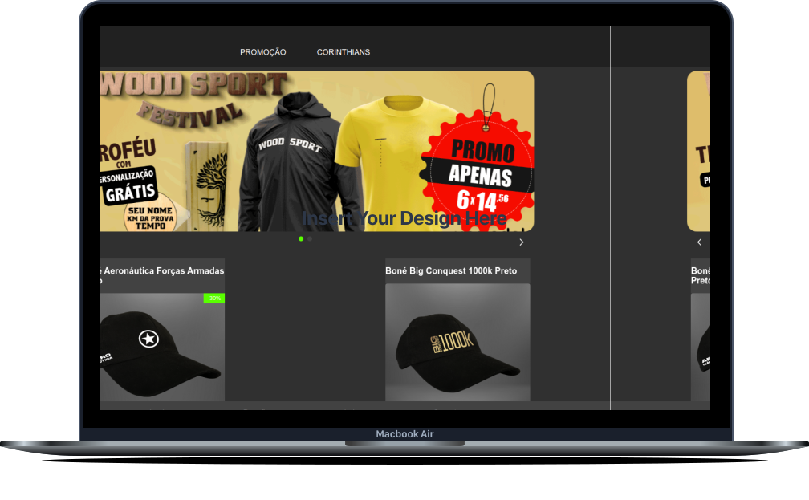

<h1 align="center">
  UpMedal
</h1>

<a href="#funcionalidades">Funcionalidades</a>&nbsp;&nbsp;&nbsp;|&nbsp;&nbsp;&nbsp;
  <a href="#tecnologias">Tecnologias</a>&nbsp;&nbsp;&nbsp;|&nbsp;&nbsp;&nbsp;
  <a href="#projeto">Projeto</a>&nbsp;&nbsp;&nbsp;|&nbsp;&nbsp;&nbsp

 

  

 

  

## Funcionalidades

- [x] Layout responsivo
- [x] Listagem de produtos por categoria
- [x] Integração com a API do WhatsApp
- [x] Criado Minicard para lista dos produtos no carrinho
- [x] Pagina do produto
- [x] Formulário de captaçao de leads
- [x] Salvar dados na AWS usando API Gateway + Lambda + DynamoDB

## Demonstração da aplicação

Acesse: <https://tarcisioupmedal--hiringcoders2021.myvtex.com/> (Para poder ver o site você precisa ter uma conta VTEX com o devido acesso.)

## 🚀 Tecnologias

Esse projeto foi desenvolvido com as seguintes tecnologias:

- VTEX IO
- React
- Typescript
- HTML
- CSS

## 💻 Projeto

Esse site foi resultado de um desafio, que tinha como objeto replicar o site
da UpMedal em uma semana utlizando o VTEX IO.

---

Feito com ♥ by Tarcisio Delmondes :wave: [Me siga no linkedin](https://www.linkedin.com/in/tarcisio-delmondes/)
